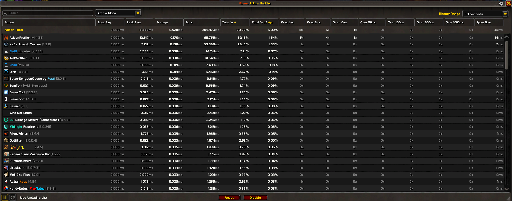
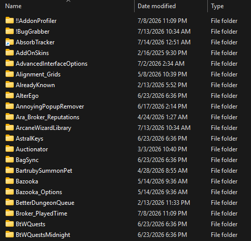
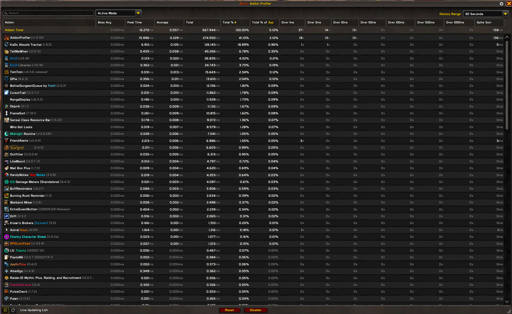
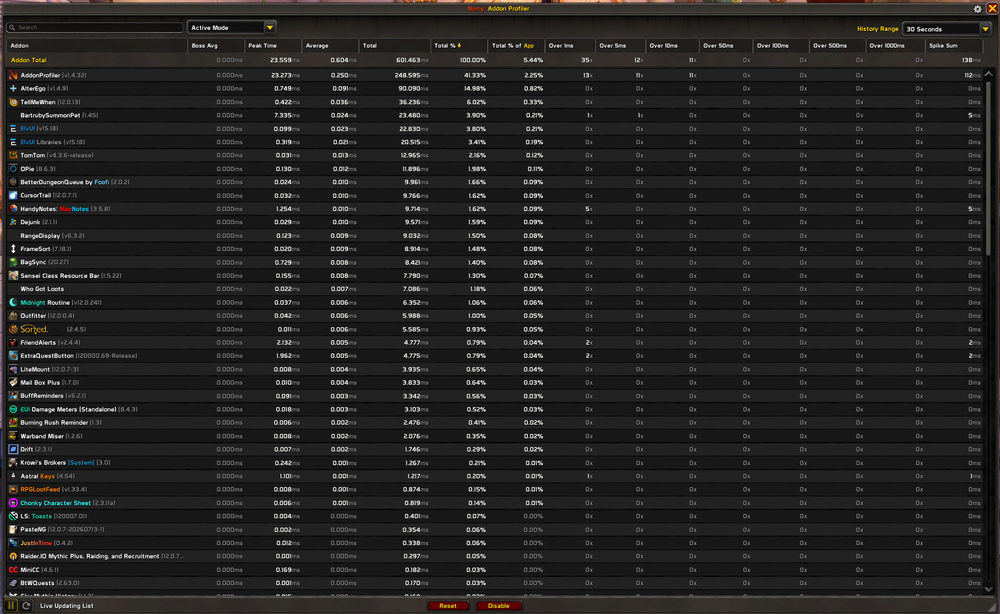

# Investigation — "Why does Ka0s Absorb Tracker use so much CPU?" (Addon Profiler attribution)

**Date:** 2026-07-14
**Trigger:** In Numy's Addon Profiler (which surfaces Blizzard's built-in `C_AddOnProfiler`
API), Ka0s Absorb Tracker ranked **#2 by CPU — above ElvUI**, which is vastly larger and also
computes absorb values. That is implausible for a single-bar addon, so we investigated.

**Two distinct findings came out of it:**

1. A **real** hotspot — global (unfiltered) `UNIT_*` event registration — which we **fixed**
   (commit `dc2a00f`). ~89% reduction in the addon's own CPU.
2. A **measurement artifact** — the remaining, still-high ranking is almost entirely
   **shared-library CPU billed to the wrong addon**. Ka0s Absorb Tracker was the *accounting
   owner* of the shared Ace3 event frame and was being blamed for **every Ace-based addon's**
   event dispatch. This is not fixable from within the addon and is not real waste.

This document records the reasoning and the evidence so it does not have to be re-derived.

---

## Finding 1 — Real hotspot: global `UNIT_*` events (FIXED)

`core/AbsorbTracker.lua` originally registered its two hottest events through AceEvent as
**global** events:

```lua
self:RegisterEvent("UNIT_ABSORB_AMOUNT_CHANGED", "OnAbsorbChanged")
self:RegisterEvent("UNIT_MAXHEALTH", "OnMaxHealthChanged")
```

Both handlers bail immediately for non-player units (`if unit ~= "player" then return end`) — but
that early-return runs in **Lua, after** the client has already delivered the event and AceEvent has
dispatched it. `UNIT_ABSORB_AMOUNT_CHANGED` and `UNIT_MAXHEALTH` fire for **every unit the client
knows about** — all raid members, their pets, nameplates, target/focus. In a raid that is a flood of
events per second, each paying a full C→Lua dispatch only to be discarded.

### The fix

AceEvent-3.0 routes all events through a **single shared frame** with plain `RegisterEvent` and
**cannot** `RegisterUnitEvent` (a WoW frame can unit-filter at most two units). So we moved just
these two events onto a **private `CreateFrame` frame** with `RegisterUnitEvent(event, "player")` —
the client filters at the C layer and the handler never runs for other units. The three global,
payload-free events (`PLAYER_ENTERING_WORLD`, `PLAYER_REGEN_DISABLED/ENABLED`) stayed on AceEvent.

This is a **documented Ka0s-standard §9.1 deviation** (events otherwise go through AceEvent),
recorded in [ARCHITECTURE.md → Standards Deviations](../../ARCHITECTURE.md#standards-deviations).

### Result (30 s window, same character, same zone)

| Metric | Before | After |
|---|---|---|
| KaOs **Total** | 477.7 ms | **53.4 ms** (−89%) |
| **Spike Sum** | 60 ms | **5 ms** |
| Over 1 ms | 27× | **1×** |
| Over 5 ms | 7× | **1×** |
| Over 10 ms | 1× | **0×** |
| Peak | 18.1 ms | **7.2 ms** |



*After the fix, KaOs is still #2 — which set up Finding 2.*

---

## Finding 2 — The real reason it out-ranks ElvUI: shared-library mis-attribution

Even after Finding 1, KaOs stayed near the top. The explanation is **how `C_AddOnProfiler`
attributes CPU**, not what KaOs does.

### The attribution rule (primary source)

From the Warcraft wiki, `C_AddOnProfiler.GetAddOnMetric` (verbatim):

> - "When an addon is loaded, any frame or timer created by that addon will have that addon
>   associated with it."
> - "Any OnEvent script is blamed on the addon associated with the **frame**, rather than the addon
>   that set the script handler."
> - "The addon blamed while the frame was originally created, will continue to be blamed, even if
>   the frame is then reused by another addon."

There is **one** LibStub instance of `AceEvent-3.0` / `CallbackHandler-1.0` shared by the entire
UI. Whichever addon **loads that copy first** (highest `MINOR`, ties broken by load order) creates
its shared event frame — and from then on, **every** Ace addon's event dispatch through that frame
is blamed on that first addon.

WoW loads addons **alphabetically by folder name**. In this UI, `AbsorbTracker` sorts near the top
(see the folder listing below), so it wins ownership of the shared Ace event frame and is billed for
the AceEvent traffic of *all* other Ace-based addons.



### The proof — a controlled disable test

We toggled *only* AbsorbTracker and re-read the profiler over the same 30 s window:

**AbsorbTracker ENABLED** — KaOs Absorb Tracker = **126.1 ms (18.89%)**; AlterEgo = 0.36 ms (0.05%):



**AbsorbTracker DISABLED** — AlterEgo jumps to **90.1 ms (14.98%)**:



**Interpretation.** The ~90–126 ms did not disappear when KaOs was disabled — it **moved to
AlterEgo**, the next addon alphabetically that uses AceEvent (`AbsorbTracker` → `AddOnSkins`… →
`AlterEgo`). That CPU is the shared Ace event dispatch of the whole UI. It was never KaOs's work;
KaOs was merely the accounting owner because it loaded the shared library first.

(The exact figures differ between the two shots because the profiler window is a rolling sample of
live combat — see caveats — but the *transfer of blame* is unmistakable.)

### Why ElvUI looks cheaper despite computing absorbs

ElvUI reads absorbs via oUF's `HealthPrediction` element — and it is **event-driven too**, calling
`UnitGetTotalAbsorbs()` on **six** events (`UNIT_HEALTH`, `UNIT_MAXHEALTH`,
`UNIT_ABSORB_AMOUNT_CHANGED`, `UNIT_HEAL_PREDICTION`, `UNIT_HEAL_ABSORB_AMOUNT_CHANGED`,
`UNIT_MAX_HEALTH_MODIFIERS_CHANGED`). It does the **identical** Blizzard call KaOs does — in fact
*more often*. ElvUI is **not** cheaper at absorbs; its cost is simply **bundled** into a large,
already-attributed element ("ElvUI/oUF unit frames") and cannot appear as a separate line item.

**A dedicated single-purpose addon is 100% visible; a mega-addon hides identical work inside a line
it is already paying.** That asymmetry — not efficiency — is why a 116-line absorb bar can rank
above ElvUI.

---

## How to read `C_AddOnProfiler` numbers correctly

- **"Total %" is share of *addon-only* CPU**, not of the game. The API's only denominator is
  `GetOverallMetric` = "measured across all user-installed addons." A reactive addon can show a big
  **%** while its absolute **ms** is tiny. KaOs's real cost after Finding 1 was ~1.8 ms/s ≈ **0.18%
  of one core** — negligible.
- **Rankings reflect the current activity window**, not intrinsic weight. A combat addon spikes
  exactly when you look. Compare absolute `RecentAverageTime` / `LastTime` ms, over the same window.
- **`PeakTime` is one worst tick** — do not read it as typical load.
- **Library work is billed to the frame's owner**, so first-to-load Ace addons carry other addons'
  costs. The AddonUsage author states the same caveat: *"It's possible for an addon to get some of
  its work blamed on another if libraries are involved… Use these numbers as a guide only."*
- **Refuted here:** there is **no** documented per-call "instrumentation tax" the profiler adds to
  an addon's numbers. The cost is ordinary Lua execution. (AceTimer was also cleared — the vendored
  MINOR 17 copy uses `C_Timer.After` with no shared `OnUpdate` frame, so it cross-charges nobody.)

---

## What is (and isn't) actionable

| Item | Status |
|---|---|
| Global `UNIT_*` events → private `RegisterUnitEvent` frame | **Done** (`dc2a00f`) — real ~89% cut. |
| Shared AceEvent-frame ownership inflating KaOs's rank | **Not fixable from the addon.** Load order is the user's; a standalone addon must ship AceEvent and may legitimately load first. Not real waste — do not chase it. |
| Per-repaint closure allocation in `modules/Timer.lua` | **Optional trim** — hoist the callback to module scope so `RequestRepaint` allocates no per-cycle closure. Small, safe, no behaviour change. |
| Value-dedup in `UpdateAbsorbBar` | **Deliberately not done** — the event-driven design spec chose against it; revisit only with explicit sign-off. |

**Bottom line:** the addon is healthy. The one real hotspot is fixed; the residual ranking is a
shared-library accounting artifact, proven by the disable test above.

---

## Sources

- [`C_AddOnProfiler.GetAddOnMetric` — attribution model](https://warcraft.wiki.gg/wiki/API_C_AddOnProfiler.GetAddOnMetric)
- [`C_AddOnProfiler.GetOverallMetric` — addon-only denominator](https://warcraft.wiki.gg/wiki/API_C_AddOnProfiler.GetOverallMetric)
- [`C_AddOnProfiler` — metric namespace](https://warcraft.wiki.gg/wiki/C_AddOnProfiler)
- [ElvUI-bundled oUF `HealthPrediction` element source](https://github.com/tukui-org/ElvUI/blob/main/ElvUI_Libraries/Game/Shared/oUF/elements/healthprediction.lua)
- [upstream oUF `HealthPrediction`](https://github.com/oUF-wow/oUF/blob/master/elements/healthprediction.lua)
- [`UnitGetTotalAbsorbs` API](https://warcraft.wiki.gg/wiki/API_UnitGetTotalAbsorbs)
- [AddonUsage — author's "library blame / guide only" caveat](https://www.curseforge.com/wow/addons/addon-usage)
- [Numy Addon Profiler](https://www.curseforge.com/wow/addons/numy-addon-profiler)
